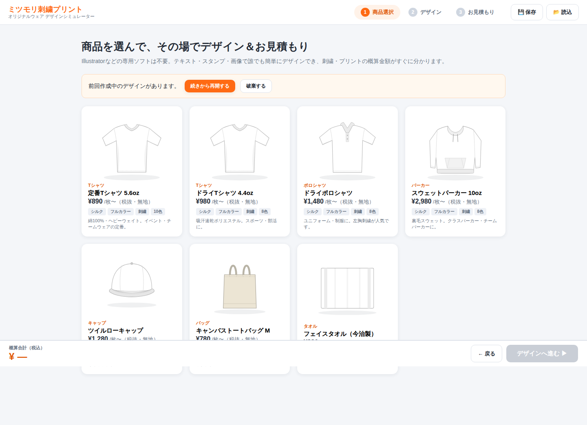
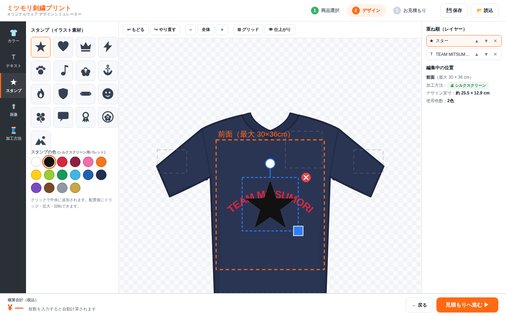
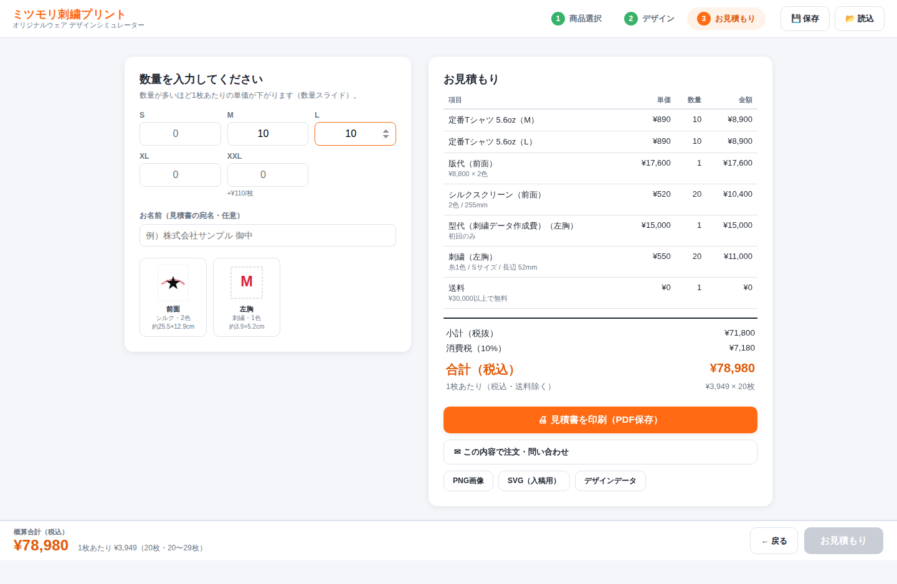

# ミツモリ デザインシミュレーター

刺繍・プリント会社のWebサイトに設置できる、**デザイン作成＋自動見積もりシミュレーター**です。
お客様がブラウザ上でオリジナルウェアをデザインし、その場で概算金額を確認、見積書の出力までできます。
（参考コンセプト：デザインシミュレーター「プリントデザイナー」のようなサービス）



## 主な機能

### お客様側

- **商品選択** — Tシャツ／ドライTシャツ／ポロシャツ／パーカー／キャップ／トートバッグ／フェイスタオル（7商品・設定で自由に追加可能）
- **ボディカラー選択** — 商品ごとに最大12色
- **デザインエディタ**（Illustrator等のソフト不要）
  - **デザインテンプレート8種**：チームロゴ・クラスT・エンブレム・名入れ（毛筆）など、ワンクリックで配置して文字を書き換えるだけ
  - テキスト入れ：ゴシック・明朝・丸ゴシック・毛筆・ポップ体など10書体、色・縁取り・文字間隔・**アーチ変形**・**縦書き**（名入れ刺繍向け）
  - スタンプ：内蔵イラスト素材16種、配置後に色変更・左右反転可能
  - 画像アップロード：JPG/PNG/GIF/WebP、**低解像度警告**（100dpi目安）
  - ドラッグ移動・拡大縮小・回転・複製・中央揃え・**中央スナップガイド**・重ね順（レイヤー）・undo/redo（Ctrl+Z）・グリッド・仕上がりプレビュー
  - **プリント位置ごとに編集**：前面・背面・左胸・袖・キャップフロントなど（商品ごとに定義）
  - タッチ操作対応（タブレットでの営業同席デモを想定）
- **加工方法をプリント位置ごとに選択**
  - 🧵 **刺繍** — 糸色パレット20色・最大6色・写真不可・型代（データ作成費）
  - 🖨 **シルクスクリーン** — インク16色・最大4色・色数×版代・数量スライド
  - 🎨 **インクジェット（フルカラー）** — 色数無制限・版代なし・サイズ区分制
- **自動見積もり**
  - サイズ別枚数入力 → 数量スライド（段階割引）・版代/型代・XXL加算・消費税・送料無料ラインまで自動計算
  - 画面下部に**概算合計を常時表示**
  - **見積書の印刷（PDF保存）**：宛名・見積No・有効期限・デザインプレビュー付き
- **保存・共有・出力**
  - **共有リンク**：デザインをURLに埋め込んでコピー（サーバー不要）。お客様にそのまま送れて、開くと同じデザイン・見積もりが再現されます
  - デザインの自動保存（ブラウザ内）と「続きから再開」
  - デザインデータのJSON保存／読み込み
  - PNG画像・SVG（ベクター入稿用）ダウンロード
  - メールでの注文・問い合わせ（内容自動転記）

### 会社側（運用）

- 商品・価格・糸色・割引率・店舗情報はすべて **`js/config.js` 1ファイルで管理**（管理画面の代わり）
- 依存ライブラリなしの静的サイト → **既存ホームページやレンタルサーバーにそのまま設置可能**
- 見積もり計算はユニットテスト済みの独立モジュール

| デザインエディタ | 自動見積もり |
|---|---|
|  |  |

## 起動方法

ビルド不要の静的サイトです。そのままWebサーバーに置くだけで動きます。

```bash
# ローカルで試す場合
python3 -m http.server 8000
# → http://localhost:8000 を開く
```

レンタルサーバー・GitHub Pages・Netlify等にフォルダごとアップロードすれば公開できます。

このリポジトリには GitHub Pages への自動デプロイ（`.github/workflows/deploy-pages.yml`）が設定済みで、
ブランチにプッシュするたびに **https://gucchi39.github.io/mitsumori/** へ自動反映されます。

## 価格・商品のカスタマイズ

すべて [`js/config.js`](js/config.js) を編集するだけです（コメント付き）。

| 設定項目 | 変数 | 内容 |
|---|---|---|
| 会社情報 | `SHOP` | 社名・住所・TEL・メール・税率・送料・送料無料ライン・見積有効期限 |
| 数量スライド | `QTY_TIERS` | 段階割引の区切り（1〜9枚／10〜19枚…） |
| 商品 | `PRODUCTS` | 商品名・単価・サイズ・カラー・プリント位置（実寸mm）・対応加工方法 |
| 加工方法・加工賃 | `METHODS` | 刺繍／シルク／インクジェットの価格表・版代/型代・色数上限 |
| 刺繍糸の色 | `THREAD_COLORS` | 糸色パレット |
| インクの色 | `INK_COLORS` | シルクスクリーン用インクパレット |
| フォント | `FONTS` | 書体の追加（Google Fonts等） |
| スタンプ素材 | `js/stamps.js` | SVGパスを追加するだけ |

## テスト

見積もり計算エンジンにはユニットテストがあります。

```bash
node --test tests/quote.test.js
```

## ファイル構成

```
index.html          画面本体（3ステップ構成）
css/style.css       スタイル（アクセント色は :root 変数で変更可）
js/config.js        ★ 店舗設定・商品マスタ・価格表（ここを編集して運用）
js/quote.js         自動見積もりエンジン（純粋関数・テスト済み）
js/editor.js        SVGデザインエディタ
js/mockups.js       商品モックアップ（SVG描画）
js/stamps.js        内蔵スタンプ素材
js/app.js           画面制御・見積書印刷・保存/出力
tests/quote.test.js 見積もりエンジンのテスト
```

## 今後の拡張候補（ロードマップ）

- 管理画面（商品・価格をブラウザから編集）
- カート・決済連携（Stripe等）、注文管理
- 会員マイページ（デザインのサーバー保存）
- デザインテンプレート集（チームT・クラスT・記念品の定番レイアウト）
- 刺繍のステッチ風プレビュー、AI/EPS入稿データのプレビュー対応
- 多言語対応

## 品質・セキュリティ

コードレビューを実施し、業務利用に向けて以下を修正済みです。

- **セキュリティ**：共有URL・読込JSONは第三者が細工できるため、読み込み時にすべての値を型・値域チェックして無害化（XSS対策）。SVG属性値もエスケープ。
- **見積もりの正確性**：送料（税込）への二重課税を修正／消費税の端数処理を `config.js` で選択可能（切捨・四捨五入・切上）／縁取り文字の実寸をサイズ区分に反映／プリント範囲外に出したデザインは課金対象から除外。
- **入稿データ**：SVG／PNGは前面・背面など**デザインのある全ての面**を書き出し（片面欠落を防止）。確定入稿では書体のアウトライン化を推奨（下記の限界を参照）。
- **UI**：スクロール時に概算バーが常に画面下部に固定されるようレイアウトを修正。共有リンクを開いても作業中の自動保存を消さないよう保護。

### 既知の限界

- エクスポートSVGはWebフォントを名前参照＋`@import`で埋め込みます。ブラウザでは再現されますが、フォント未所持のIllustrator等では代替書体になります。**確定入稿時は文字のアウトライン化**をご検討ください（将来的に自動アウトライン化を予定）。
- 写真（画像）は共有URLには含まれません（サイズの都合）。共有相手には別途画像をお送りください。

## 注意事項

- `js/config.js` の価格・商品はサンプル値です。**公開前に必ず貴社の価格表に書き換えてください。**
- 見積もりはWEB上の概算であり、正式見積もりはデータ確認後に案内する運用を想定しています（見積書にも注記が入ります）。
